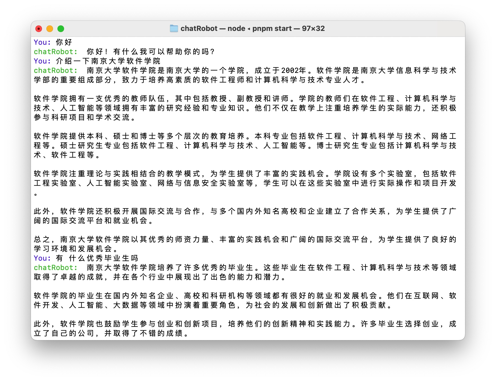

# ChatRobot

一个基于ChatGpt的命令行聊天机器人

### 快速开始

依赖安装

```
$ pnpm install
```

在根目录下新建.env文件，添加如下环境变量，xxxxxxxxxxxxxx为你的openai的api_key。

```javascript
// .env
OPEN_API_KEY=xxxxxxxxxxxxxxxxxxx
```

默认使用的是国内某代理的Host，如需更改，在bot.ts文件下更改basePath即可

```typescript
openAi = new OpenAIApi(
    new Configuration({
      basePath: "https://api.chatanywhere.com.cn/v1",
      apiKey: process.env.OPEN_API_KEY,
    })
  );
```

启动机器人

```
$ pnpm start
```

### 使用示例


